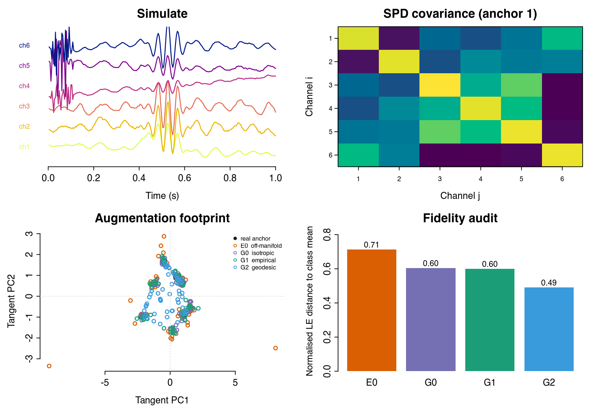

# TensorEEG

**Physics-Constrained EEG Simulation and Covariance-Aware Augmentation**

<p align="center">
  
</p>

[](https://cran.r-project.org/)
[](LICENSE.md)
[](DESCRIPTION)

TensorEEG is an R package that does two things end-to-end:

1. **Simulate** physically-consistent synthetic EEG as a 3rd-order tensor
   $\mathcal{X} \in \mathbb{R}^{T \times C \times K}$, with volume-conduction
   geometry, structured oscillations, and trial-wise manifold drift.
2. **Audit** covariance-level data augmentation for cross-session BCI
   transfer through a covariance-aware augmentation family
   (E0 / G0 / G1 / G2 / A0), a six-metric covariance fidelity audit,
   and manifest-based replay for cross-language reproducibility.

It is the reference R implementation for Shen & Degras (2026),
*Covariance Geometry as a Safety Constraint for Cross-Session BCI
Augmentation: A Multi-Dataset Non-Inferiority and Fidelity Audit.*

---

## What's new in 0.10.0

| Module | Functions | What they do |
|---|---|---|
| **Augmentation family** | `augment_cov_amplitude_matched_euclidean()` (E0), `augment_cov_riemannian()` (G0), `augment_cov_empirical_tangent()` (G1), `augment_cov_geodesic_mixup()` (G2), `augment_cov_alignment_riemannian()` (A0) | Five SPD-aware ways to expand a covariance set, ranging from off-manifold Euclidean control to log-Euclidean geodesic mixup |
| **Fidelity audit** | `audit_covariance_fidelity()` + 5 standalone metrics (`cov_affine_invariant_distance`, `cov_eigenvalue_correlation`, `cov_trace_ratio`, `cov_condition_ratio`, `cov_anchor_perturbation_distance`) | Six-metric audit, raw + dimension-normalised, that lets you decide whether a synthetic stack is safe to use downstream |
| **Manifest replay** | `read_calibration_manifest()`, `replay_from_manifest()` | Read the per-cell calibration manifest written by the Python protocol driver and reconstruct the synthetic stack byte-equivalently in R |
| **Drift options** | `generate_drift_rotations(process = "ou" \| "fbm", hurst = ...)` | Mean-reverting OU/AR(1) drift (default) or long-memory fBm drift via Mandelbrot--van Ness kernel |
| **Safety guard** | Internal `.warn_synthetic_real_ratio()` | Warns when n_aug per anchor risks the budget-dependent failure documented in the paper at synthetic:real >= 3:1 |
| **Bundled examples** | `data(example_anchors)`, `inst/extdata/example_manifest.csv` | Eight 6 x 6 SPD anchors and a 10-row manifest; vignettes and tests run out of the box without external data |

---

## Installation

```r
# install.packages("devtools")
devtools::install_github("Yiming-S/TensorEEG", build_vignettes = TRUE)
```

To get the vignettes locally you must pass `build_vignettes = TRUE`;
otherwise `vignette(package = "TensorEEG")` will be empty.

---

## Quick start

The shortest end-to-end audit you can run after installation. No
external data required --- the bundled `example_anchors` is enough.

```r
library(TensorEEG)
data(example_anchors)
labels <- readRDS(system.file("extdata", "example_labels.rds",
                              package = "TensorEEG"))

# 1. Augment the anchors four ways.
aug_e0 <- augment_cov_amplitude_matched_euclidean(
            example_anchors, n_aug = 3, g0_sigma = 0.15,
            labels = labels, seed = 1001)
aug_g0 <- augment_cov_riemannian(
            example_anchors, n_aug = 3, sigma = 0.15,
            labels = labels, seed = 1002)
aug_g1 <- augment_cov_empirical_tangent(
            example_anchors, labels, n_aug = 3, sigma = 0.15, seed = 1003)
aug_g2 <- augment_cov_geodesic_mixup(
            example_anchors, labels, n_aug = 3, beta_alpha = 1.0, seed = 1004)

# 2. Run the six-metric fidelity audit on each.
audit <- function(a) audit_covariance_fidelity(
  example_anchors, a$cov, a$anchor)$normalized$log_euclidean

sapply(list(E0 = aug_e0, G0 = aug_g0, G1 = aug_g1, G2 = aug_g2), audit)
#>     E0     G0     G1     G2
#>  0.713  0.604  0.600  0.491
```

Lower distance = closer to the class-mean covariance geometry.
The expected ranking E0 > G0 > G1 > G2 is reproduced in seconds on
the bundled toy data.

---

## The four pieces

### Simulate

`sim_eeg_master()` generates a 3rd-order tensor
$\mathcal{X} \in \mathbb{R}^{T \times C \times K}$ from a physically-
constrained generative process. Three design choices set it apart
from naive additive-noise simulators:

**Volume-conduction physics.** Sources are placed on a Fibonacci grid
on the unit sphere and projected through a forward mixing matrix that
is regularised with Tikhonov smoothing on a normalised graph Laplacian:

$$
\mathbf{A}_\text{smooth} = (\mathbf{I} + \lambda \mathcal{L}_\text{sym})^{-1} \mathbf{A}_\text{raw}.
$$

This gives spatial coherence and rank deficiency that match real EEG.

**Manifold drift.** Trial-to-trial non-stationarity is modeled as a
geodesic walk on $SO(n)$:

$$
\mathbf{A}_k = \mathbf{A}_\text{base} \exp(\theta_k \mathbf{\Omega}_\text{base}),
$$

with $\theta_k$ following an OU/AR(1) process. The output respects
PARAFAC2 structure (shared eigenvalues, evolving eigenvectors). Set
`process = "fbm"` in `generate_drift_rotations()` for long-memory
drift via a Mandelbrot--van Ness kernel.

**Closed-loop SNR.** SNR is calibrated against an effective AC-power
metric measured after a 4th-order Butterworth high-pass at 0.1 Hz, so
slow drift cannot inflate apparent neural power.

### Augment

Five covariance-level augmentation routines that share the same
SPD-manifold definitions but differ in *where* they place synthetic
samples:

| Code | Function | Where it places synthetic samples |
|---|---|---|
| **E0** | `augment_cov_amplitude_matched_euclidean()` | Off-manifold Euclidean perturbation, calibrated so the median anchor distance matches G0's --- the "fair" off-manifold control |
| **G0** | `augment_cov_riemannian()` | Isotropic tangent jitter at each anchor; legacy log-Euclidean baseline |
| **G1** | `augment_cov_empirical_tangent()` | Class-aware Gaussian in tangent coordinates with Ledoit--Wolf shrinkage |
| **G2** | `augment_cov_geodesic_mixup()` | Same-class log-Euclidean geodesic interpolation; the most fidelity-preserving variant in the audit |
| **A0** | `augment_cov_alignment_riemannian()` | Transductive Riemannian alignment of source covariances to the (unlabeled) target session mean |

E0/G0/G1/G2 are non-transductive: they need only labeled source
covariances and a seed. A0 is transductive and consumes the unlabeled
target stack.

### Audit

`audit_covariance_fidelity()` returns six metrics in one call:

- **log-Euclidean distance** to a class-mean reference,
- **affine-invariant Riemannian distance** to the same reference,
- **eigenvalue correlation** with the reference,
- **trace ratio** (synthetic mean over reference),
- **condition-number ratio**, and
- **anchor-perturbation distance** (mean log-Euclidean distance from
  each synthetic to its anchor).

Every distance is also reported dimension-normalised by
$\sqrt{p(p+1)/2}$ so audits across datasets with different channel
counts can be pooled honestly. The five standalone metric functions
are exported individually if you want to mix them into a custom
pipeline.

### Replay

The covariance audit reported in Shen & Degras (2026) is run by a
Python protocol driver (`scripts/protocol/`) that writes a
`calibration_manifest.csv` recording, for every
$(\text{dataset}, \text{subject}, \text{budget}, \text{resample}, \text{method}, \text{class})$
cell, the source-trial ids, per-method seed, and augmentation ratio.

`read_calibration_manifest()` parses that CSV; `replay_from_manifest()`
reconstructs the synthetic stack for one cell using the recorded
seeds. The output is byte-equivalent to a direct seeded call to the
same augmentation routine, which means the audit trail is closed:
anyone with the manifest, the source covariances, and TensorEEG can
reproduce the synthetic stack without rerunning the Python driver.

A0 is intentionally not replayable from manifest seeds alone (it
needs the target session covariances), so it is documented as a
supplement-only routine.

---

## Vignettes

```r
browseVignettes("TensorEEG")
```

| Vignette | What it walks through |
|---|---|
| [`tensoreeg-validation`](vignettes/tensoreeg-validation.Rmd) | Spatial and temporal covariance validation of `sim_eeg_master()` --- volume conduction, low-rank source structure, ACF peaks at the configured target frequencies |
| [`covariance-audit`](vignettes/covariance-audit.Rmd) | The end-to-end E0 / G0 / G1 / G2 fidelity audit on the bundled `example_anchors`, reproducing the ranking shown above |
| [`manifest-replay`](vignettes/manifest-replay.Rmd) | Cross-language reproducibility demo: read the bundled manifest CSV, replay each method's synthetic stack, and verify byte-equivalence to a direct seeded call |

---

## Testing

```r
# from package root, with devtools installed:
devtools::test()
```

The test suite is currently 367 tests across 8 files, including 48
end-to-end integration tests that exercise the full
`sim_eeg_master() -> tensor_to_cov() -> augment_cov_*() ->
audit_covariance_fidelity()` pipeline and verify byte-equivalent
manifest replay.

---

## Citation

If you use TensorEEG in published work, please cite both the paper
and the software:

```bibtex
@article{ShenDegras2026,
  author = {Shen, Yiming and Degras, David},
  title  = {Covariance Geometry as a Safety Constraint for
            Cross-Session BCI Augmentation: A Multi-Dataset
            Non-Inferiority and Fidelity Audit},
  year   = {2026}
}

@software{ShenTensorEEG2026,
  author = {Shen, Yiming},
  title  = {TensorEEG: A covariance-aware EEG simulation and
            augmentation toolkit},
  version = {0.10.0},
  year    = {2026},
  url     = {https://github.com/Yiming-S/TensorEEG}
}
```

---

## References

1. Harshman, R. A. (1972). *PARAFAC2: Mathematical and technical
   notes*. UCLA Working Papers in Phonetics.
2. Lütkepohl, H. (2005). *New Introduction to Multiple Time Series
   Analysis*. Springer.
3. Uhlenbeck, G. E., & Ornstein, L. S. (1930). On the theory of the
   Brownian motion. *Physical Review*, 36(5), 823--841.
4. Higham, N. J. (2008). *Functions of Matrices: Theory and
   Computation*. SIAM.
5. Chung, F. R. K. (1997). *Spectral Graph Theory*. American
   Mathematical Society.
6. Nunez, P. L., & Srinivasan, R. (2006). *Electric Fields of the
   Brain: The Neurophysics of EEG* (2nd ed.). Oxford University Press.
7. Barachant, A., Bonnet, S., Congedo, M., & Jutten, C. (2011).
   Multiclass brain-computer interface classification by Riemannian
   geometry. *IEEE Transactions on Biomedical Engineering*, 59(4),
   920--928.
8. Mandelbrot, B. B., & Van Ness, J. W. (1968). Fractional Brownian
   motions, fractional noises and applications. *SIAM Review*, 10(4),
   422--437.
9. Ledoit, O., & Wolf, M. (2004). A well-conditioned estimator for
   large-dimensional covariance matrices. *Journal of Multivariate
   Analysis*, 88(2), 365--411.

---

## License

MIT. See [LICENSE.md](LICENSE.md).
